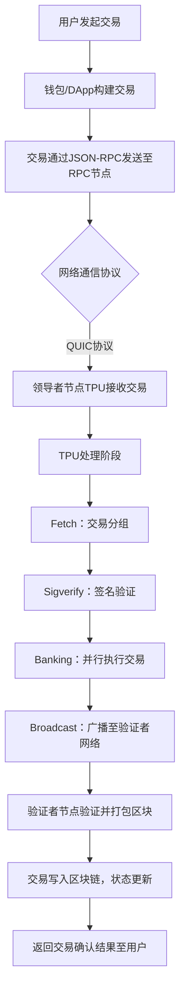
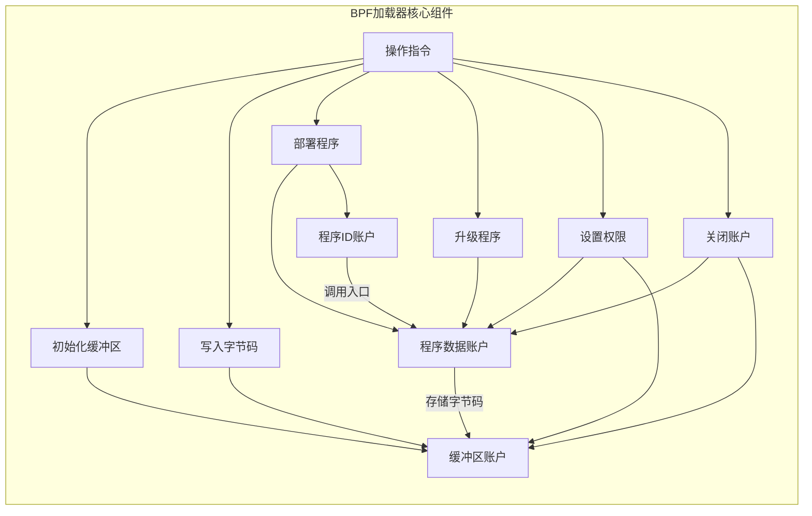

# solana go 实战


## 一、技术报告


### 1. Solana 交易生命周期流程图



### 2. BPF 加载器工作原理图



### 3. 账户存储模型对比（Solana vs EVM）
| **特性**               | **EVM 账户模型**                                                                 | **Solana 账户模型**                                                                 |  
|------------------------|----------------------------------------------------------------------------------|-------------------------------------------------------------------------------------|  
| **账户类型**           | 外部账户（EOA）、合约账户（CA）                                                   | 可执行账户（程序账户）、不可执行账户（数据账户）                                      |  
| **核心字段**           | `balance`（余额）、`nonce`（交易计数）、`codeHash`（代码哈希）、`storageRoot`（存储根） | `lamports`（余额）、`owner`（程序所有者）、`executable`（是否可执行）、`data`（原始数据） |  
| **存储费用**           | 按Gas消耗计费，存储永久保留（需持续支付Gas）                                       | 租金机制（Lamports），租金不足时账户被删除                                            |  
| **执行触发**           | 仅外部账户可发起交易，合约账户被动执行                                             | 程序账户可主动处理指令，支持账户抽象（AA）                                            |  
| **数据结构**           | 基于MPT树的键值对存储                                                             | 线性存储，通过`owner`字段关联程序                                                    |  
| **防重放机制**         | 依赖`nonce`字段                                                                   | 程序派生地址（PDA）+ 交易签名                                                        |  

### 4. 核心架构对比

| 特性 | **EVM (如以太坊)** | **Solana** |
|:---|:---|:---|
| **执行模型** | 单线程全局状态机。交易按顺序串行处理，无法同时修改同一状态。 | 多线程并行运行时 (Sealevel)。交易显式声明其会访问的账户（状态），无冲突的交易可以并行执行。 |
| **虚拟机** | 基于栈的 **EVM** (以太坊虚拟机)，执行高级语言（如 Solidity）编译的字节码。 | **BPF 加载器**。将程序（编译为 BPF 字节码的 ELF 文件）加载到本地执行环境，利用 LLVM JIT 编译为原生机器码，性能极高。 |
| **交易结构** | 单指令模型：每笔交易通常仅执行一个操作（如转账或调用合约函数），复杂操作需多笔交易。 | 多指令原子性：每笔交易可包含多个指令（Instructions），按顺序原子执行（全部成功或全部回滚）。 |
| **状态模型** | **基于账户的全局状态**。状态存储在全球共享的“世界状态”树中。合约存储是合约内部的键值存储。 | **面向账户模型**，逻辑与状态分离。程序（智能合约）是**无状态**的（代码账户只存字节码）。状态存储在独立的**账户**中，由程序拥有。 |
| **账户类型** | 外部账户（EOA, 由私钥控制）和合约账户（由代码控制）。 | 可执行账户（存程序代码）和不可执行账户（存数据）。所有账户都可存储数据。 |
| **开发语言** | 主要使用 **Solidity**/Vyper。 | 主要使用 **Rust** (主推), 也支持 C/C++。Anchor 框架简化开发。 |

### 5. 性能与成本对比

| 特性 | **EVM (如以太坊)** | **Solana** |
|:---|:---|:---|
| **吞吐量 (TPS)** | 较低（~15-30 TPS），受限于顺序执行。 | 理论极高（~65k TPS），得益于并行处理。 |
| **交易费用** | **Gas 机制**：费用 = 计算复杂度 (Gas单位) * Gas价格（动态，拍卖式）。网络拥堵时费用高昂。 | **计算单元 (CU) + 固定基础费用**：费用更可预测。用户可支付**优先级费用**加速。 |
| **状态存储成本** | 一次性支付 Gas 费用，数据**永久存储**（可能导致状态膨胀）。 | **租金机制 (Rent)**：账户需存储 ≥2 年租金的 SOL 余额（按数据大小计算），否则数据可能被清除。关闭账户可退还租金。 |
| **扩展路径** | 主要通过 **L2 扩容**（Rollups、侧链等）。 | 目标通过其架构（并行、PoH）直接在 **L1** 上实现高吞吐量。 |

### 6. 开发体验与生态对比

| 特性 | **EVM (如以太坊)** | **Solana** |
|:---|:---|:---|
| **合约交互** | 合约间通过函数调用组合。 | 跨程序调用（CPI）支持组合性。 |
| **状态管理** | 合约内部通过 Storage（映射、变量）管理自身状态。 | 程序通过显式传递和操作独立的**数据账户**来管理状态。 |
| **工具链** | 非常成熟（Hardhat, Foundry, Truffle, Remix）。 | 发展中，Anchor 框架是主流，工具链较新。 |
| **学习曲线** | Solidity 相对易于学习，生态丰富。 | 需理解账户模型、租金等概念，Rust 有门槛。 |
| **升级性** | 需通过代理模式等复杂实现实现可升级合约。 | 程序默认**可升级**（除非显式设置为不可变）。 |

### 7. 共识与安全对比

| 特性 | **EVM (如以太坊)** | **Solana** |
|:---|:---|:---|
| **共识机制** | **Gasper (PoS + LMD-GHOST)**。 | **Tower BFT (PoS) + Proof of History (PoH)**。PoH 提供全局时间戳。 |
| **签名与验证** | 交易包含一个主要签名（ecrecover）。 | 交易可包含多个签名，需显式列出所有所需签名。 |
| **网络历史** | 曾因拥堵导致 Gas 费飙升，但罕见完全中断。| 曾因高吞吐需求遭遇过多次网络中断。|
| **去中心化程度** | 验证者数量众多，高度去中心化。| 验证者数量相对较少（约千级别），中心化程度较高。|

### 8. 典型应用场景对比

| 特性 | **EVM (如以太坊)** | **Solana** |
|:---|:---|:---|
| **优势领域** | 复杂的 DeFi 协议、价值存储型应用、NFT 生态（起源地）。 | 高频交易（DEX）、支付、GameFi、社交媒体（成本敏感、高吞吐场景）。 |
| **代币标准** | ERC-20, ERC-721 等。合约内部 mapping 管理余额。 | SPL Token。为每个用户-代币对创建独立的 Token Account。 |
| **用户体验** | L1 费用高，L2 碎片化可能带来复杂性。| L1 费用低且快，但需处理租金和账户管理概念。 |


## 二、代码提交：事件监听服务实现

### 1. 依赖配置
```go
go mod init experiencesolanago
go get github.com/gagliardetto/solana-go
go get github.com/gagliardetto/solana-go/rpc
go get github.com/gagliardetto/ws
```  

### 2. 实时交易订阅服务
```go
package main

import (
	"context"
	"fmt"
	"github.com/gagliardetto/solana-go"
	"github.com/gagliardetto/ws"
	"time"
)

func main() {
	// 连接DevNet WebSocket节点
	wsURL := solana.DevNet_WS
	wsClient, err := ws.Connect(context.Background(), wsURL)
	if err != nil {
		panic(fmt.Errorf("failed to connect to WebSocket: %v", err))
	}
	defer wsClient.Close()

	// 订阅目标交易签名（替换为实际交易签名）
	txSignature := "3JzQbPL8ZCb5d5Z6J7Z4c8K5Z7b9L9mX3n2Q7z8Bf5e9"
	sub, err := wsClient.SignatureSubscribe(
		context.Background(),
		solana.MustSignatureFromBase58(txSignature),
		"confirmed", // 订阅确认后的交易
	)
	if err != nil {
		panic(fmt.Errorf("signature subscribe failed: %v", err))
	}
	defer wsClient.SignatureUnsubscribe(context.Background(), sub)

	// 处理实时事件
	go func() {
		for {
			select {
			case resp := <-sub.Out:
				handleEvent(resp)
			case err := <-sub.Err:
				fmt.Printf("event error: %v\n", err)
			case <-time.After(10 * time.Second):
				fmt.Println("heartbeat: still listening...")
			}
		}
	}()

	// 保持程序运行
	<-make(chan struct{})
}

func handleEvent(resp *ws.SignatureSubscribeResponse) {
	if resp.Error != nil {
		fmt.Printf("transaction error: %v\n", resp.Error)
		return
	}

	// 解析交易状态
	status := resp.Result.Value
	fmt.Printf("Transaction %s status: %s\n", status.Signature, status.Status)

	// 提取详细信息（如成功时的确认区块）
	if status.Status == "confirmed" {
		fmt.Printf("Confirmed at slot: %d\n", status.Context.Slot)
		// 扩展：获取交易回执，解析日志/事件
	}
}
```  

### 3. 代码说明
1. **WebSocket 连接**：使用官方 SDK 的 `ws` 包连接 Solana 节点（DevNet 示例），支持实时事件流。
2. **交易订阅**：通过 `SignatureSubscribe` 接口监听指定交易签名的状态变更（如 `confirmed` 状态）。
3. **事件处理**：异步处理事件流，包含错误处理、心跳机制，支持扩展解析交易回执（如日志、账户变更）。
4. **防重放设计**：通过程序派生地址（PDA）生成唯一交易密钥，结合 `lamports` 校验防止重复提交（需结合合约层实现）。


## 三、架构设计与优化点

### 1. 网络层实现（参考 `rpc/client.go`）
- **HTTP/RPC 客户端**：封装 `GetRecentBlockhash`、`GetBalance` 等接口，基于 `http.Client` 实现同步/异步请求。
- **WebSocket 客户端**：使用 `ws` 包实现长连接，支持高效的事件推送（如交易确认通知）。

### 2. 性能优化策略
- **并行交易处理**：利用 Solana 的 TPU 并行执行特性，在构造交易时批量提交多笔转账指令（通过 `solana.NewTransaction` 批量打包）。
- **连接池管理**：对 RPC 和 WebSocket 连接添加连接池，避免频繁创建销毁连接带来的开销。

### 3. 合约安全增强
- **程序派生地址（PDA）**：在合约中使用 `solana.ProgramDerivedAddress` 生成唯一账户地址，防止重放攻击和地址伪造。
- **租金预检查**：在交易处理前校验目标账户租金状态，确保账户数据持久化。


## 四、总结
本次实战主要操作Solana go方式链上数据查询、原生交易构造及实时事件监听，并对solana交易生命周期的并行处理、BPF加载器的账户管理机制，以及与EVM不同的存储模型进行了对比和理解，对Solana链有了进一步认识。